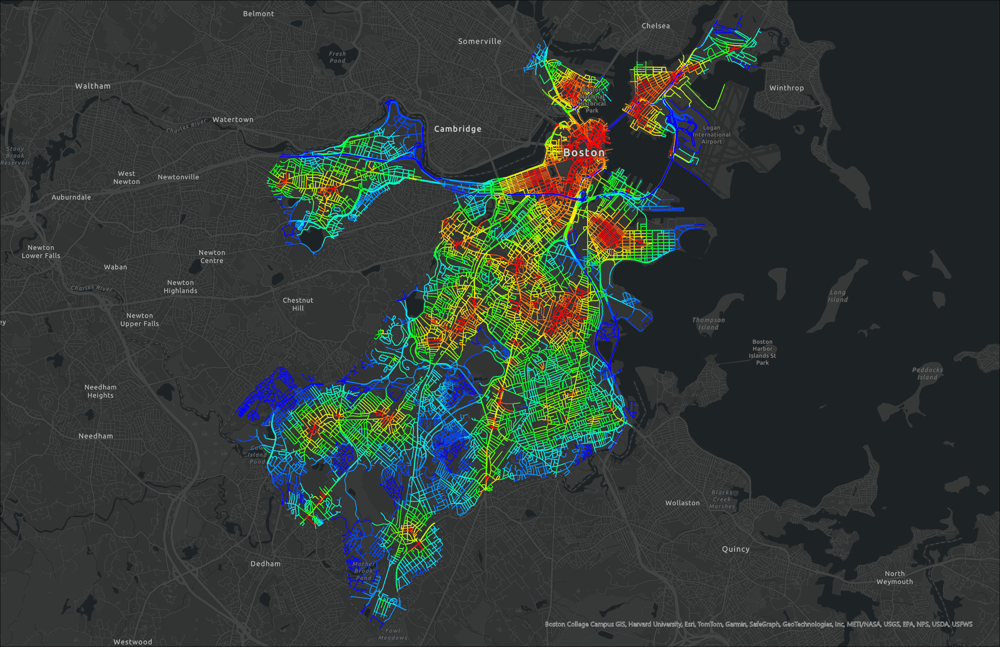

## Graph Theory Urbanism

A geospatial project utilizing parallel ArcGIS (sDNA, ArcPy) and Python (NetworkX) workflows to triangulate results for graph theory simulations of cities.

<table>
  <tr>
    <td valign="center"></td>
    <td valign="center"></td>
  </tr>
  <!-- <tr>
    <td valign="center">Boston, USA</td>
    <td valign="center">Kaunas, Lithuania</td>
  </tr> -->
 </table>

In progress as part of a research collaboration between the Massachusetts Institute of Technology (MIT) and the Vilnius Academy of Arts (VDA) under the New European Bauhaus (NEB) Interdisicplinary Initiatives and MIT International Science and Technology Initiatives (MISTI).

<table>
  <tr>
    <td valign="center"></td>
  </tr>
  <tr>
    <td valign="center">Overview of parallel processes; see detailed geoprocessing workflow documented in <a href="/Code/Process.ipynb"><u> here in this jupyter notebook.</u></a>
  </a></td>
  </tr>
 </table>